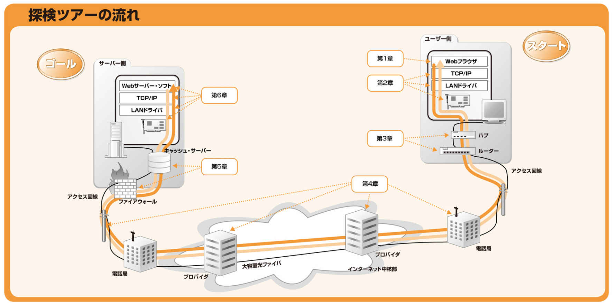

ブラウザにURLを入力してからホームページに表示されるまでの流れを追いながら説明してくれる本。

1.Webブラウザ
---
**Webブラウザがメッセージを作る**

<u>内容：WebブラウザがURLを解析して、どういう通信を行うのか。</u>

Webブラウザが担当するのは以下の作業。
1. HTTPリクエスト・メッセージを作成
2. WebサーバーのIPアドレスをDNSサーバーに問い合わせ
3. 世界中のDNSサーバーが連携してIPアドレスを特定
4. OS(プロトコルスタック)にメッセージの送信依頼

具体的には以下の流れ。

**1.HTTPリクエスト・メッセージを作成<br>**
URLからリスエストヘッダー・メッセージを作成する。

**2.WebサーバのIPアドレスをDNSサーバーに問い合わせ<br>**
ブラウザはメッセージをネットワークに送り出す機能は持っていない。 → OSに依頼する。<br>
OSに送信依頼するときはドメイン名ではなく、IPアドレスで送信先を指定する必要がある。 → DNSサーバに教えてもらう。<br>
Javaでいうと`java.net`パッケージに含まれるようなSocketライブラリの関数を用いて、URL⇒IPアドレスの変換を行う。

サンプル<br>
InetAddressクラスでIPアドレスとかホスト名とか簡単に取得できる。
```java
import java.net.*;

public class DnsTest {
	public static void main(String[] args) {
		try {
			InetAddress localhost = InetAddress.getLocalHost();
			System.out.println("hostname:" + localhost.getHostName());
			System.out.println("IP adress:" + localhost.getHostAddress());
		}
		catch (UnknownHostException e) {
			System.out.println(e.getMessage());
			System.exit(-1);
		}
	}
}
```

**3.世界中のDNSサーバーが連携してIPアドレスを特定**


2.プロトコル・スタック・LANアダプタ
---
**TCP・IPのデータを電気信号にして送る**

<u>内容：Webブラウザから叩いて、OS内でどのように処理していくのか。</u>

OS内での処理は以下。
1. ソケットを作成
2. サーバーに接続
3. データを送受信
4. サーバーから切断してソケットを抹消
5. IPとイーサネットのパケット送受信動作
6. UDPプロトコルを用いた送受信動作

3.ハブ・スイッチ・ルーター
---
**ケーブルの先はLAN機器だった**

<u>内容：どのようにインターネットに接続するのか。</u>

4.アクセス回路・プロバイダ
---
**アクセス回線を通ってインターネットの内部へ**

<u>内容：インターネットの内部ではどのように処理しているのか。</u>

5.ファイアウォール・キャッシュ・サーバー
---
**サーバー側のLANには何がある**

<u>内容：サーバー側ではどのようにスタンバイしているのか。</u>

6.Webサーバー
---
**Webサーバーに到着し、応答データがWebブラウザに戻る**

<u>内容：サーバ側ではどのように処理しているのか。</u>